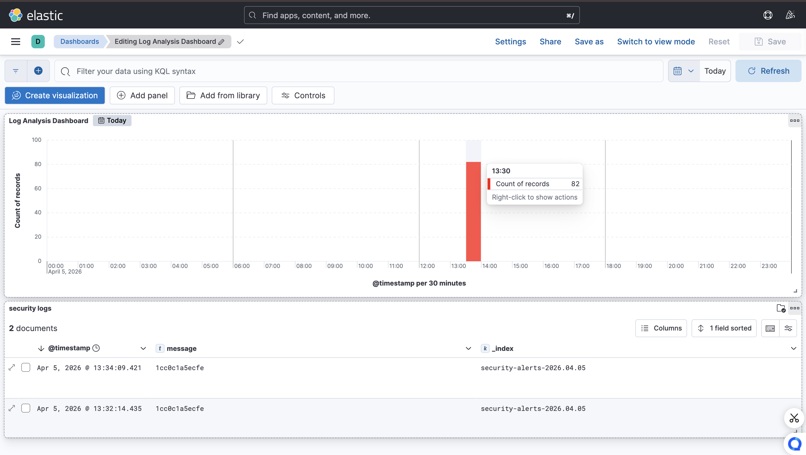

# 🛡️ Real-Time Security Log Analysis & Alerting System
A professional SIEM (Security Information and Event Management) setup using the **ELK Stack** (Elasticsearch, Logstash, Kibana) to monitor and alert on suspicious login activity.

## 🚀 Features
* **Real-time Log Ingestion:** Uses Logstash to process JSON security events.
* **Automated Alerting:** Threshold-based logic to detect brute-force attempts.
* **Interactive Dashboard:** Visualizes successful vs. failed logins and high-severity alerts.

## 📊 Dashboard Preview

## 🛠️ Tech Stack
* **Docker & Docker Compose:** Containerized environment.
* **Elasticsearch:** Data indexing and storage.
* **Logstash:** Server-side data processing pipeline.
* **Kibana:** Data visualization and SOC dashboard.mkdir screenshots